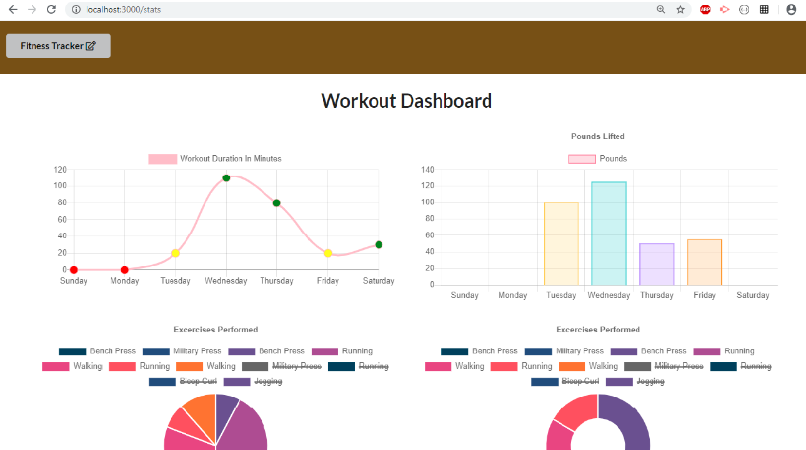

# Workout Tracker

  
## Table of contents:

-   [ Description ](#description)
-   [ Installation ](#installation)
-   [ Deployed Link ](#deployed)
-   [ Usage ](#usage)
-   [ License ](#license)

## <a name="description"></a>Description:

 Workout tracker app helps one to view, create and track daily workouts. The user can log multiple exercises in a workout on a given day. The logger can view the workout details for a given week in the dashboard area.
 Workout logger is created with MongoDB, Node, Express, CSS and HTML.

## <a name="installation"></a>Installation:

```bash
    npm init
    npm i mongoose body-parser
    npm i express morgan
```
## <a name="deployed"></a>Deployed Link:

https://fitness-trac.herokuapp.com/

## <a name="usage"></a>Usage:
```bash
    npm run start 
```


## <a name="contributing"></a>Contributing:
Pull requests are welcome. For major changes, please open an issue first to discuss what you would like to change.Code of Conduct: Standard (Fork, Clone, Commit, Push and Create Pull requests).

## <a name="license"></a>License:
 <i>MIT Copyright (c). All rights reserved.</i>

